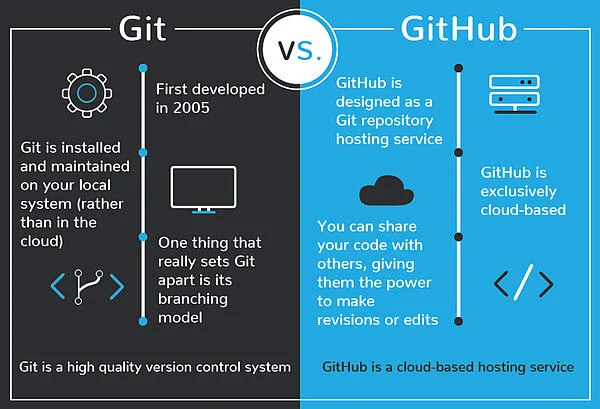

# Learning Class 03: Git to GitHub
In order to collaborate with others in building and perfecting code, there needs to be an environment that facilitates real-time collaboration among developers working on projects together. GitHub is the place where this type of collaboration may occur via a web-based graphical interface. While GitHub is the **place** where developers can share and publish code and network with other developers within a web environment, Git repositories are where the collaboration among project teams occurs. GitHub acts as the hosting service for these Git repositories. Git repositories include built-in **version control known as 'Git'** to support project collaboration while being able to track the changes made to a shared file and why. However, it is important to recognize that Git and GitHub are not synonymous. Unlike GitHub, Git is installed and maintained on a developer's local system. 

## What is Git?

Git is the version control system that allows a developer to work with a Git repository and the associated files on their own computer. Changes to text files within the repository on the local Git system are then saved as a new version of the repository in Git through the Add-Committ-Push process while still maintaining previous change records. Git includes a unique branching structure that allows a coder to create independent code saved to different branches. This essentially allows a developer to try out new ideas, set aside certain branches for differing purposes, and to jump back to earlier branches. In order to collaborate on a Git project a remote repository or a version of the project residing within GitHub or on a network.

## Git to GitHub using A-C-P
In Git, there are three states that a file may be in when being worked with: Modified, Staged, or Committed. A modified state, is when a file has been worked on but the changes are not yet being tracked. In order to begin tracking the changes, the modified changes must be added to git's version control in the staging state (**Add**). Once the modifications have been added to be tracked, the next stage is to commit the changes to the repository (**Commit**). During the commit stage, the developer includes a message to accompany the commit that explains what has been changed and why. Finally, in order to communicate the changes that have been made with the explanation to team members, the change must then be pushed to the desired GitHub branch for consideration (**Push**).

## Table Contents
* [*About Me*](README.md)
* [*What is a Growth Mindset*](GrowthMindset.md)
* [*Learn About GitHub*](Markdown.md)
* [*A Coder's Computer*](coders_computer.md)
* [*Learning Git to GitHub*](GitHub_03.md)
* [*HTML and Wireframing*](Structure.md)
